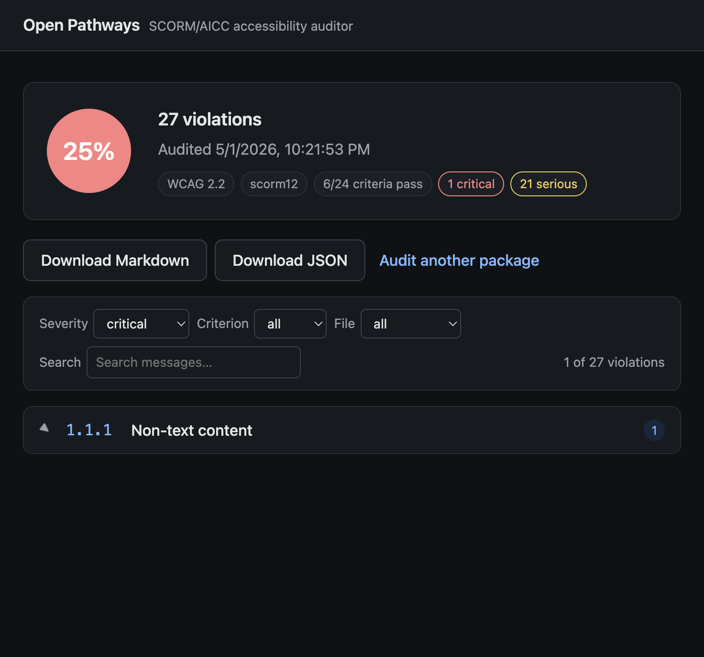

# Open Pathways — Web

Local web UI for the [Open Pathways](../README.md) SCORM/AICC accessibility
auditor. Drop a `.zip` into the browser, watch progress stream in, read the
WCAG 2.2 AA report inline.

This is a thin layer on top of the audit core in `../src`. Audit logic lives
there and is **never duplicated here** — the web app calls `audit()` as a
library and reuses the existing JSON/Markdown reporter for downloads.



## Quick start

```bash
# from the project root
npm install --prefix web    # install web-only deps (express, multer, open)
npm run serve               # opens http://127.0.0.1:4280 in your default browser
```

Drop a `.zip`, click **Select a file**, or hit **Try a sample** to use the
bundled fixture.

## Flags

| Flag                     | Default | Notes                                                              |
| ------------------------ | ------- | ------------------------------------------------------------------ |
| `--port <n>`             | `4280`  | Override the listen port. Also reads `OPEN_PATHWAYS_PORT`.         |
| `--no-open`              | off     | Start the server but don't auto-launch a browser. Useful for CI.   |
| `-h`, `--help`           | —       | Print help and exit.                                               |
| `-v`, `--version`        | —       | Print the web package version and exit.                            |

`--port` precedence: explicit flag → `npm_config_port` → `OPEN_PATHWAYS_PORT`
→ default `4280`.

### Running through `npm run serve`

npm consumes some flag forms before the script ever sees them. These all work:

```bash
npm run serve --no-open                    # default port, no browser launch
npm run serve --port=4291 --no-open        # equals form for --port
npm run serve -- --no-open --port 4291     # explicit -- separator
node web/server/index.js --port 4291       # bypass npm entirely
OPEN_PATHWAYS_PORT=4291 npm run serve      # env override
```

The space form `npm run serve --port 4291` is a known npm wart — npm consumes
`--port` itself and only forwards the bare `4291`, so the server starts on
the default port and prints a warning. Use one of the forms above instead.

### Optional global shorthand

```bash
cd web && npm link    # registers `open-pathways-web` on PATH
open-pathways-web --port 4291
```

## What's where

```
web/
├── server/
│   ├── index.js        ← entry: arg parsing, port, browser launch, SPA route
│   ├── job-manager.js  ← in-memory FIFO job queue + SSE replay buffer
│   ├── lib/launch.js   ← cross-platform `open` wrapper
│   └── routes/
│       └── audits.js   ← upload, SSE, JSON/MD download, sample, cancel
├── public/             ← vanilla-JS SPA, no build step
│   ├── index.html
│   ├── app.js
│   └── styles.css
├── test/
│   └── smoke-phase2.sh ← shell-only end-to-end smoke test
└── screenshots/
    └── results-view.png
```

## API

The browser SPA is the intended client, but every endpoint also works from
`curl` and is documented below for scripting.

| Method | Path                            | Notes                                                            |
| ------ | ------------------------------- | ---------------------------------------------------------------- |
| `POST` | `/api/audits`                   | `multipart/form-data`. Field `package` (the `.zip`). Optional fields: `standard`, `packageType`, `browser`, `timeoutDynamic`. Returns `{ jobId, status }`. |
| `GET`  | `/api/audits`                   | List of recent jobs (in-memory; no persistence).                 |
| `GET`  | `/api/audits/:id`               | Snapshot: status, options, summary on completion, last event.   |
| `GET`  | `/api/audits/:id/events`        | Server-Sent Events stream. Events: `progress`, `done`, `error`, `cancelled`. |
| `POST` | `/api/audits/:id/cancel`        | Best-effort cancel (see below).                                  |
| `GET`  | `/api/audits/:id/report.json`   | Full JSON scorecard (same shape as the CLI's `results.json`).    |
| `GET`  | `/api/audits/:id/report.md`     | Full Markdown report.                                            |
| `GET`  | `/api/sample`                   | Streams a built-in sample fixture for the **Try a sample** button. |
| `GET`  | `/api/version`                  | `{ name, version }`.                                             |

## Behavior notes worth knowing

- **Local-only.** Binds to `127.0.0.1`. No auth, no LAN exposure.
- **In-memory job state.** Restart the server, jobs are gone. Each job's
  upload is deleted **10 minutes after completion**, then the job entry is
  dropped. Reopen `/job/:id` before that window to re-render or re-download.
- **Concurrency = serial.** Jobs run one at a time in FIFO order. Multiple
  uploads queue up; you'll see `pending` in the snapshot until your turn.
- **Upload cap = 1 GB** (multer-enforced). Larger packages will be rejected
  before any work starts.
- **Auto-start on drop.** Dropping a file is the intent — there is no
  separate "Audit" button. Same for **Select a file** and **Try a sample**.
- **Persistent prefs.** WCAG standard and package-type selections are saved
  to `localStorage` per browser. The browser engine is intentionally not
  exposed — dynamic checks require Chromium (Firefox/WebKit don't expose
  the accessibility tree via CDP).
- **Reload-safe `/job/:id`.** A reload re-fetches the snapshot. If the job
  is gone (server restarted, or it's been more than 10 minutes since it
  finished) the UI shows a clear "no longer available" message.
- **Recent audits panel.** The idle view lists up to 10 jobs still in memory
  so you can re-open a result without re-uploading.

## Cancel

Hitting **Cancel** while an audit is running:

1. Server aborts the audit pipeline's `AbortSignal`, marks the job
   `cancelled`, and closes the SSE stream — the UI returns to idle.
2. `audit()` checks the signal between every static check and the dynamic
   runner closes Playwright as soon as the signal fires, so any in-flight
   `page.goto()` unblocks within Playwright's connection teardown
   (typically <1s).

Net effect: cancel-to-stop is ~1 second even mid-Playwright. The signal
contract lives in `../src/index.js` (`options.signal`), added in Phase 6 of
the cloud roadmap; `/web` consumes the upgrade via two lines of wiring in
`server/job-manager.js` and `server/routes/audits.js`.

## Stack and constraints

- **Server:** Express, multer, `open` v8 (last CommonJS-compatible release).
- **Frontend:** vanilla HTML / CSS / JS. No framework, no bundler. One
  `index.html`, one `app.js`, one `styles.css`. System font stack;
  light/dark via `prefers-color-scheme`.
- **Progress:** Server-Sent Events (one direction, server → browser).
- **No build step.** If a feature seems to need React or a bundler, raise
  it as a discussion before adding tooling.
- **No persistence.** In-memory jobs only. SQLite or similar would be a
  separate, deliberate decision.

## Smoke test

```bash
bash web/test/smoke-phase2.sh
```

Boots the server on a free port, uploads a fixture, follows SSE until done,
fetches both report formats, asserts. Useful in CI and after refactors.

## Status

Phases 1–4 complete. See `PLAN.md` for the original build plan and any
remaining v2-track items.
